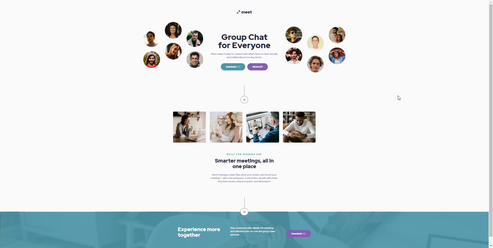

# Meet Landing page
This is a challenge from the website [frontendmentor.io](https://www.frontendmentor.io)
You can find the challenge [here](https://www.frontendmentor.io/challenges/meet-landing-page-rbTDS6OUR)
The design and assets belongs to frontendmentor.io 
while all of the code belongs and was made by me

## Screenshots
### Design Target

### Project Result

## Live Site
[Live site link](https://meet-landing-page-smoky.vercel.app/)

## Procedure
My approach for this site was a mobile-first philosophy that adds complexity as the
screen size gets larger. The site is fully responsive from mobile to tablet and to desktop.
I aimed to make my code and file architecture modular and reusable. Despite just being a demo, I put an effort to make all my code readable and maintanable. The site was made with accessibility in mind, giving awareness to users who would tab through sites and to screen reader users.

## Methodologies
- [BEM (Block-Element-Modifier)](http://getbem.com/)
- [Modified 7-1 Sass Architecture](https://sass-guidelin.es/#architecture)
- Mobile-first philosophy
- Responsive site design
- Accessible site design

## Technologies used
- Semantic HTML
- SCSS(sassy css) preprocessor
